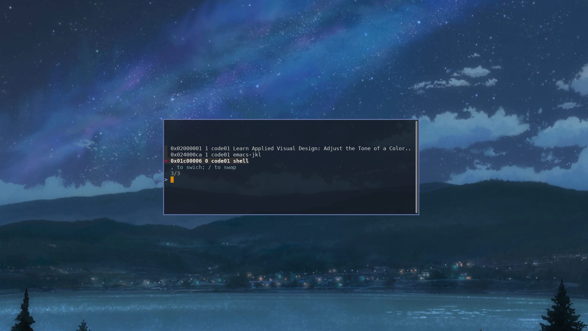

# X window interface in Bash

screenshot
<p align="center">
  
</p>

this repo is a collection of bash scripts/functions I have been using along with i3wm

dependence:
- fzf
- xdotool
- wmctrl
- transset(optional)

  # i3 examples
  ## use fzf to select window
  add lines below to your i3 config, replace $super+comma to your key, then you can select or swap current window to target window via fzf in a floating terminal.
  ```bash
  for_window [title="^select_window$"] floating enable
  bindsym $super+comma exec gnome-terminal --geometry=80x15 --title='select_window' -- /path/to/xwish/fzf_window.sh $(xdotool getactivewindow)
  ```

  ## cycle windows in current workspace
  ```bash
  bindsym F3 exec /path/to/xwish/focus_next_win.sh`
  ```
  add this to your i3 config, then you can use F3 to goto next unfocused window in current workspace, this is very useful if you prefer to open 2 or 3 windows in one workspace, instead of bind four keys repectively for `focus {left, right, up, down}` , this only consume one keybinding.
